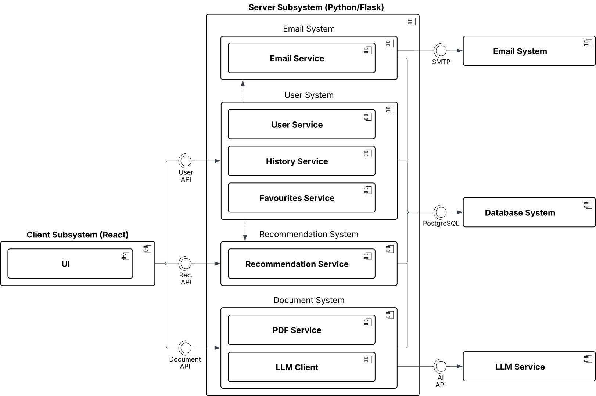

# LEARN-Hub

A recommendation system prototype for Computer Science education activities that leverages automated content processing and category-based scoring algorithms to support teachers in activity selection and lesson planning.

This system was developed as part of a Master's thesis at the Technical University of Munich, Chair of Applied Education Technologies. The architecture prioritises transparency and explainability, enabling teachers to understand how recommendations are generated rather than relying on opaque black-box algorithms.

## Overview

LEARN-Hub addresses the challenge of finding appropriate educational activities for computer science courses by implementing an intelligent recommendation engine. The system processes educational activity documents, analyses their pedagogical characteristics, and generates personalised recommendations based on teacher requirements such as target age group, available resources, and learning objectives aligned with Bloom's Taxonomy.

The recommendation engine implements content-based filtering with category-based scoring, offering an explainable alternative to collaborative filtering approaches. Teachers receive detailed scoring breakdowns across age appropriateness, topic relevance, duration fit, Bloom alignment, and series cohesion, fostering agency and trust in the recommendation process.

## Architectural Overview

The system implements a three-tier containerised web application architecture following the System Design Document approach:

**Client Subsystem**: A React single-page application provides an interactive user interface for teachers and administrators. The client implements role-based access control, supports both light and dark themes, and maintains session-based authentication using sessionStorage for enhanced security on shared school computers.

**Server Subsystem**: A Flask REST API server orchestrates the core application logic through specialised internal systems. The Recommendation System encapsulates the algorithmic intelligence. The User System manages identity through user, history, and favourites services. The Document System oversees content ingestion via PDF processing and LLM-assisted metadata extraction.

**Data Layer**: PostgreSQL serves as the primary data store, managing activities, user accounts, search history, and favourites. The database schema supports complex relationships between activities, topics, and user preferences whilst maintaining referential integrity.

**Containerisation**: Docker Compose orchestrates three containerised services on a single host, connected via an internal bridge network. The deployment includes health checks and dependency chains to ensure proper sequencing during startup.

### Design Goals

The architecture addresses several key quality attributes:

- **Transparency (QA3)**: Category-based scoring with detailed breakdowns enables teachers to understand recommendations
- **Maintainability (QA7)**: Clear, explicit code with dependency injection favours clarity over convenience
- **Performance (QA5, QA6)**: Two-stage scoring pipeline and hard filtering ensure sub-three-second response times
- **Extensibility (QA1, QA8)**: Comprehensive OpenAPI documentation enables integration with external learning platforms

## Architecture Diagrams

The `docs/figures/` directory contains UML diagrams documenting the system architecture:

- **Subsystem Decomposition** ([`docs/figures/final-lucid-subsystem.svg`](docs/figures/final-lucid-subsystem.svg)): Shows the internal components of the server and client subsystems
- **Deployment Diagram** ([`docs/figures/final-lucid-deployment.svg`](docs/figures/final-lucid-deployment.svg)): Container topology, volumes, and external service dependencies
- **Analysis Object Model** ([`docs/figures/final-lucid-aom.svg`](docs/figures/final-lucid-aom.svg)): Domain entities and their relationships



## Quick Start
See [`docs/dev-setup.md`](docs/dev-setup.md)

## Services

Once running, access the system at:

- **Client**: http://localhost:3001
- **Server API**: http://localhost:5001
- **API Documentation**: http://localhost:5001/api/openapi
- **Hosted API Documentation (test deployment)**: https://learnhub-test.aet.cit.tum.de/api/openapi/swagger

## Environment Configuration

The application requires environment variables for API integrations, security keys, and database configuration:

```bash
cp example.env .env
```

Key configuration variables:
- `LLM_API_KEY` - API key for automated content processing
- `FLASK_SECRET_KEY` - Flask session security
- `JWT_SECRET_KEY` - JWT token signing
- `SQLALCHEMY_DATABASE_URI` - PostgreSQL connection string
- `SMTP_*` - Email service configuration for teacher verification

See `example.env` for a complete list of configurable variables.

## Documentation

**User Documentation**: https://ls1intum.github.io/LEARN-Hub/

**Developer Documentation** is organised in the `docs/` directory by architectural layer:

### Local Development
- [`docs/dev-setup.md`](docs/dev-setup.md) - Quick local development setup guide

### Core System
- [`docs/core/recommendation-engine.md`](docs/core/recommendation-engine.md) - Recommendation algorithm design, scoring methodology, and architectural decisions

### Server
- [`docs/server/server-architecture.md`](docs/server/server-architecture.md) - Server architecture and design patterns
- [`docs/server/api.md`](docs/server/api.md) - REST API endpoints and data models
- [`docs/server/server-cicd.md`](docs/server/server-cicd.md) - Development workflow and deployment procedures

### Client
- [`docs/client/client-architecture.md`](docs/client/client-architecture.md) - Client architecture and component design
- [`docs/client/api-integration.md`](docs/client/api-integration.md) - Client-server integration patterns
- [`docs/client/client-cicd.md`](docs/client/client-cicd.md) - Build system and deployment

## Technology Stack

**Server**:
- Python 3.13 with modern type hints and performance improvements
- Flask 3.0 with Flask-OpenAPI3 for automatic API documentation
- SQLAlchemy ORM with Alembic migrations
- PostgreSQL 17+ for relational data persistence
- Gunicorn WSGI server for production deployment

**Client**:
- React 19 with TypeScript for type safety
- Vite for rapid build tooling with hot module replacement
- Tailwind CSS for utility-first styling
- shadcn/ui for accessible interface elements
- Nginx for production serving and API proxying

**Infrastructure**:
- Docker for containerisation with multi-stage builds
- Docker Compose for container orchestration
- GitHub Container Registry for image distribution

**Development Tools**:
- `uv` for Python dependency management
- pytest for server testing
- Vitest for client testing
- ESLint and Ruff for code quality

## Development Commands

### Server
```bash
cd server/
make dev          # Start development server
make test         # Run tests with coverage
make lint-fix     # Check and fix code quality
make format       # Format code
make db-setup     # Run database migrations
```

### Client
```bash
cd client/
make dev          # Start development server
make test         # Run tests
make build        # Build for production
make lint         # Check code quality
```
