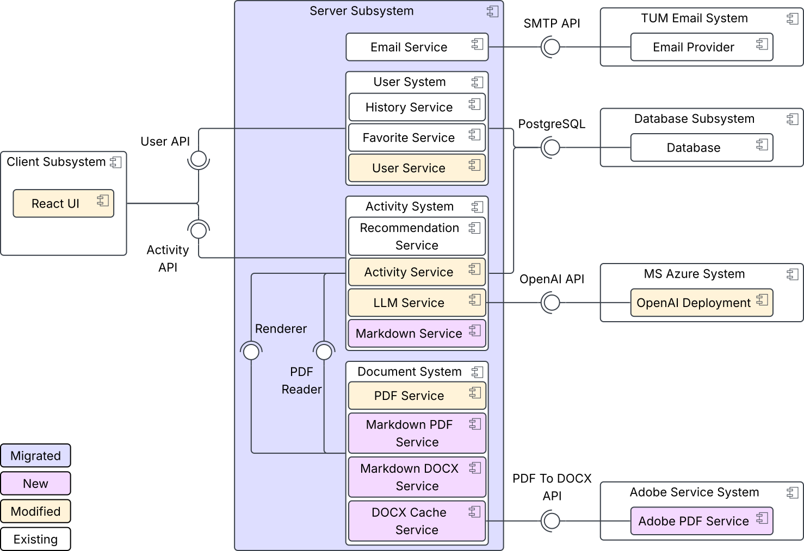

# LEARN-Hub

A recommendation system prototype for Computer Science education activities that leverages automated content processing and category-based scoring algorithms to support teachers in activity selection and lesson planning.

This system was developed as part of a Master's thesis at the Technical University of Munich, Chair of Applied Education Technologies. The architecture prioritises transparency and explainability, enabling teachers to understand how recommendations are generated rather than relying on opaque black-box algorithms.

## Overview

LEARN-Hub addresses the challenge of finding appropriate educational activities for computer science courses by implementing an intelligent recommendation engine. The system processes educational activity documents, analyses their pedagogical characteristics, and generates personalised recommendations based on teacher requirements such as target age group, available resources, and learning objectives aligned with Bloom's Taxonomy.

The recommendation engine implements content-based filtering with category-based scoring, offering an explainable alternative to collaborative filtering approaches. Teachers receive detailed scoring breakdowns across age appropriateness, topic relevance, duration fit, Bloom alignment, and series cohesion, fostering agency and trust in the recommendation process.

## Architectural Overview

The system implements a three-tier containerised web application architecture following the System Design Document approach:

**Client Subsystem**: A React single-page application provides an interactive user interface for teachers and administrators. The client implements role-based access control, supports both light and dark themes, and uses Spring Security session cookies with CSRF protection for authentication.

**Server Subsystem**: A Spring Boot REST API server orchestrates the core application logic through specialised internal systems. The Recommendation System encapsulates the algorithmic intelligence. The User System manages identity through user, history, and favourites services. The Document System oversees content ingestion via PDF processing, LLM-assisted metadata extraction and document generation, and optional PDF-to-DOCX conversion via Adobe PDF Services.

**Data Layer**: PostgreSQL serves as the primary data store, managing activities, user accounts, search history, and favourites. The database schema supports complex relationships between activities, topics, and user preferences whilst maintaining referential integrity.

**Containerisation**: Docker Compose orchestrates three containerised services on a single host, connected via an internal bridge network. The deployment includes health checks and dependency chains to ensure proper sequencing during startup.

### Design Goals

The architecture addresses several key quality attributes:

- **Transparency (QA3)**: Category-based scoring with detailed breakdowns enables teachers to understand recommendations
- **Maintainability (QA7)**: Clear, explicit code with dependency injection favours clarity over convenience
- **Performance (QA5, QA6)**: Two-stage scoring pipeline and hard filtering ensure sub-three-second response times
- **Extensibility (QA1, QA8)**: Comprehensive OpenAPI documentation enables integration with external learning platforms

## Architecture Diagrams

The `docs/figures/` directory contains UML diagrams documenting the system architecture:

- **Subsystem Decomposition** ([`docs/figures/final-lucid-subsystem.svg`](docs/figures/final-lucid-subsystem.svg)): Shows the internal components of the server and client subsystems
- **Deployment Diagram** ([`docs/figures/final-lucid-deployment.svg`](docs/figures/final-lucid-deployment.svg)): Container topology, volumes, and external service dependencies
- **Analysis Object Model** ([`docs/figures/final-lucid-aom.svg`](docs/figures/final-lucid-aom.svg)): Domain entities and their relationships



## Quick Start

See [`docs/dev-setup.md`](docs/dev-setup.md) for the full development setup guide.

**Quick start**:
```bash
# Start PostgreSQL
docker compose -f docker/compose.yml up postgres -d

# Run migrations
make db-migrate

# Start server and client
make dev
```

If you run the Spring Boot server locally, install LibreOffice first so `soffice` is available for DOCX generation. On macOS:

```bash
brew install --cask libreoffice
```

If you run the full stack in Docker instead, the server image already includes LibreOffice.

## Services

Once running, access the system at:

- **Client**: http://localhost:3001
- **Server API**: http://localhost:5001
- **API Documentation**: http://localhost:5001/api/openapi/swagger

## Environment Configuration

The application requires environment variables for API integrations, security keys, and database configuration:

```bash
cp example.env .env
```

Key configuration variables:
- `LLM_BASE_URL` - Base URL of the OpenAI-compatible chat API (e.g. an Ollama or GPU cluster endpoint)
- `LLM_API_KEY` - API key for the text LLM
- `LLM_MODEL_NAME` - Chat model name
- `LLM_MODEL_VISUAL` - Optional vision-capable model for exercise generation with image input
- `LLM_IMAGE_AZURE_ENDPOINT` / `LLM_IMAGE_AZURE_API_KEY` / `LLM_IMAGE_AZURE_DEPLOYMENT_NAME` - Optional Azure OpenAI image model for generating exercise illustrations
- `ADOBE_PDF_SERVICES_CLIENT_ID` / `ADOBE_PDF_SERVICES_CLIENT_SECRET` - Optional Adobe PDF Services credentials for PDF-to-DOCX conversion
- `SESSION_TIMEOUT` - Optional override for server-side session lifetime
- `SESSION_COOKIE_MAX_AGE` - Optional override for persistent login cookie lifetime
- `CLIENT_ALLOWED_ORIGINS` - Optional override for cross-origin client URLs
- `POSTGRES_DB_URI` - PostgreSQL JDBC connection string
- `PDF_PATH` - Host path for PDF file storage
- `DOCX_CACHE_PATH` - Optional host path for caching converted DOCX files
- `EMAIL_*` / `SMTP_*` - SMTP service configuration for teacher verification emails

See `example.env` for a complete list of configurable variables.

## External Services

LEARN-Hub integrates with the following external services. All integrations are optional except where noted.

### Text LLM — Required for activity content generation

The server uses a **text chat model** (via Spring AI's OpenAI client) for:
- Extracting structured activity metadata from uploaded PDFs
- Generating Artikulationsschema, Deckblatt, Hintergrundwissen, Übung, and Lösungsblatt markdown documents

Configure any OpenAI-compatible endpoint (Ollama, GPU cluster, cloud API):

```
LLM_BASE_URL=https://gpu.aet.cit.tum.de/ollama/v1
LLM_API_KEY=<key>
LLM_MODEL_NAME=qwen3:30b-a3b
```

Optionally, a **vision-capable model** can be configured separately for exercise generation with PDF page images as input:

```
LLM_MODEL_VISUAL=<vision-model-name>
```

### Azure OpenAI Image Model — Optional

When configured, the server calls Azure OpenAI's image generation API to replace `[[IMAGE_PLACEHOLDER: ...]]` markers in generated exercise and Tafelbild documents with actual images. Without this, placeholders are left in the markdown as-is.

```
LLM_IMAGE_AZURE_ENDPOINT=https://<resource>.openai.azure.com/
LLM_IMAGE_AZURE_API_KEY=<key>
LLM_IMAGE_AZURE_DEPLOYMENT_NAME=gpt-image-1
```

### Adobe PDF Services — Optional

When configured, the server converts uploaded PDFs to DOCX via the [Adobe PDF Services REST API](https://developer.adobe.com/document-services/apis/pdf-services/) (ExportPDF operation). This enables higher-fidelity source document preservation in the editor. Without credentials the server starts normally, but DOCX export endpoints return an error.

```
ADOBE_PDF_SERVICES_CLIENT_ID=<client-id>
ADOBE_PDF_SERVICES_CLIENT_SECRET=<client-secret>
```

Converted DOCX files are cached to avoid redundant API calls; the cache location defaults to `/app/data/docx-cache` and can be overridden with `DOCX_CACHE_PATH`.

### SMTP Server — Required for teacher registration

Email delivery (teacher verification codes and credentials) uses an SMTP server with STARTTLS on port 587:

```
SMTP_SERVER=postout.lrz.de
SMTP_PORT=587
EMAIL_USERNAME=<username>
EMAIL_PASSWORD=<password>
EMAIL_ADDRESS=<from-address>
```

## Documentation

**User Documentation**: https://ls1intum.github.io/LEARN-Hub/

**Developer Documentation** is organised in the `docs/` directory by architectural layer:

### Local Development
- [`docs/dev-setup.md`](docs/dev-setup.md) - Quick local development setup guide

### Core System
- [`docs/core/recommendation-engine.md`](docs/core/recommendation-engine.md) - Recommendation algorithm design, scoring methodology, and architectural decisions

### Server
- [`docs/server/server-architecture.md`](docs/server/server-architecture.md) - Server architecture and design patterns
- [`docs/server/api.md`](docs/server/api.md) - REST API endpoints and data models
- [`docs/server/server-cicd.md`](docs/server/server-cicd.md) - Development workflow and deployment procedures

### Client
- [`docs/client/client-architecture.md`](docs/client/client-architecture.md) - Client architecture and component design
- [`docs/client/api-integration.md`](docs/client/api-integration.md) - Client-server integration patterns
- [`docs/client/client-cicd.md`](docs/client/client-cicd.md) - Build system and deployment

## Technology Stack

**Server**:
- **Java 21** with Spring Boot 3.4.1
- **Spring Data JPA** with Hibernate ORM
- **Flyway** for database migrations
- **PostgreSQL 17+** for relational data persistence
- **Spring AI** with OpenAI-compatible API for LLM integration
- **Spring Security** with server-side session authentication
- Maven for dependency management

**Client**:
- React 19 with TypeScript for type safety
- Vite for rapid build tooling with hot module replacement
- Tailwind CSS for utility-first styling
- shadcn/ui for accessible interface elements
- Nginx for production serving and API proxying

**Infrastructure**:
- Docker for containerisation with multi-stage builds
- Docker Compose for container orchestration
- GitHub Container Registry for image distribution

**Development Tools**:
- Maven for Java dependency management
- JUnit for server testing
- Vitest for client testing
- LibreOffice for server-side DOCX generation in local development

## Development Commands

### Server
```bash
cd server/
make dev          # Start development server
make test         # Run tests
make build        # Build the application
make db-migrate   # Run Flyway migrations
```

### Client
```bash
cd client/
npm run dev       # Start development server
npm run test:run  # Run tests
npm run build     # Build for production
npm run lint      # Check code quality
```
